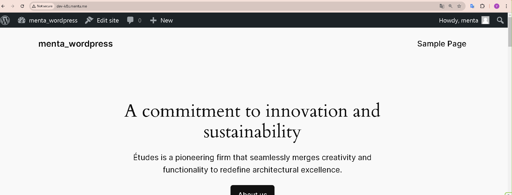

# namespaceの作成

```
kubectl create namespace dev-menta-k8s
```

# namespaceの確認
```
kubectl.exe get namespaces
NAME              STATUS   AGE
default           Active   32h
dev-menta-k8s     Active   26s
kube-node-lease   Active   32h
kube-public       Active   32h
kube-system       Active   32h
```

# カスタムiamgeをbuildするためのDockerfile作成
```
drwxr-xr-x 1 yuuuk 197121   0 Oct  1 10:27 app/
-rw-r--r-- 1 yuuuk 197121 410 Oct  3 01:10 docker-compose.yml
drwxr-xr-x 1 yuuuk 197121   0 Oct  1 03:36 mysql/
drwxr-xr-x 1 yuuuk 197121   0 Oct  1 03:36 nginx/
```

# イメージのbuild
```
docker-compose build --no-cache
```

# マニフェストファイルの作成
```
-rw-r--r-- 1 yuuuk 197121 1581 Oct  4 09:22 app.yaml
-rw-r--r-- 1 yuuuk 197121 2018 Oct  1 23:44 mysql.yaml
-rw-r--r-- 1 yuuuk 197121  412 Sep 29 17:37 secrets.yaml
-rw-r--r-- 1 yuuuk 197121  216 Oct  4 21:30 service.yaml

```
※　secrets.yamlはgitignoreする

# マニフェストファイルの適用
```
kubectl apply -f ***.yaml
```

# マニフェストファイル適用後のリソース確認
```
# podが全て Runningになっていることを確認

$ kubectl get pods -n dev-menta-k8s
NAME                                READY   STATUS    RESTARTS        AGE
mysql-deployment-9cbc46cd-nk5zk     1/1     Running   1 (4d21h ago)   5d7h
nginx-deployment-7fc58c7888-5fztj   2/2     Running   0               43h          54m

$ kubectl get pvc -n dev-menta-k8s
NAME            STATUS   VOLUME                                     CAPACITY   ACCESS MODES   STORAGECLASS   VOLUMEATTRIBUTESCLASS   AGE
mysql-pvc       Bound    pvc-4d864b7f-9e87-41e0-950f-c851f140f5f2   1Gi        RWO            hostpath       <unset>                 34h

```

# hostsの設定

```
127.0.0.1 dev-k8s.menta.me
```

# wordpress設定
```
vim wp-config.php
```

# ブラウザ確認
http://dev-k8s.menta.me




